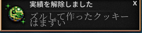

# Cookie Clicker


## Cookie Clicker とは

『クッキークリッカー』（Cookie Clicker）は、2013年8月8日に公開されたブラウザゲームで、作者はOrteilことジュリアン・シーノット（Julien Thiennot）というフランスのプログラマーである。

### 概要

画面に現れるクッキーを1回クリックするごとに1枚（アイテムで1クリックあたりの枚数を増やすことができる）クッキーを焼くことができる。焼いたクッキーはクッキーの生産施設購入費用に充てることができ、次第に大量のクッキーが手に入るようになる仕組みをとっている。

クッキーで購入できる施設には、10秒に1枚のクッキーを生産できる「カーソル」をはじめ、1秒毎に1クッキーの「グランマ（おばあさん）」といった具合に、「宇宙船」、「タイムマシン」、「反物質コンデンサ」、「プリズム」などがあり、それらによってさらに多くのクッキー生産が可能となる。また、それらの施設単体のクッキー生産能力を強化（アップグレード）することも可能である。クッキー生産量の単位は「Cps（Cookies per second）」と呼ばれる。ごく稀に画面上に「ゴールデンクッキー」が現れ、これをクリックすることで一時的にクリック、および施設のクッキー生産能力が強化されたり、大量のクッキーを入手できる。ある程度までクッキーを焼くと、一度リセットしたうえで永続的な効果を持つ特殊なクッキーと名声レベルを獲得したうえで周回プレイが可能になる。


[【クッキーおばあさん】飽きるまでクッキークリッカー【なちょこのアルバイト】](https://www.youtube.com/watch?v=jlPD-sEcP-A)


## Cookie Clicker Hacking

Cookie Clicker のプログラムコードを書き換えることによってクリックを自動化したり，アイテムを取得したり，ゴールデンクッキーを出現させたりすることができる。

### Cookie Clicker サイト

- [本家サイト](http://orteil.dashnet.org/cookieclicker/)
- [日本語版](http://natto0wtr.web.fc2.com/CookieClicker/)
- [日本語版 wiki](https://w.atwiki.jp/cookieclickerjpn/)
- [コード](./src/main.js)

### 準備(ブラウザの開発コンソールを出す)

1. [ゲーム画面を右クリック -> 新しいタブで開く](http://natto0wtr.web.fc2.com/CookieClicker/)
2. キーボードの入力を半角モードへ
3. (ctrl + shift + I or F12) または 右クリックのメニューから検証を選択
4. Consoleのタブを選択
5. (ctrl + l) コンソールの消去
6. allow pasting


### Hack してみよう

// 5506行目 Game.Prompt=function(content,options,updateFunc,style)


``` js
Game.Prompt('Hack this site! wwwwwwwwwww', 0)
```

#### Try it!

表示する文字列を任意の文字列にかえてみよう

- 表示する文字列はシングルクォーテーション `'` でくくること
- 半角英数字で入力!!  大文字と小文字もきちんと!!

### クッキーをズルして増やしてみよう

// 1387行目 Game.cookies=0;//cookies


```
Game.cookies = 999
```

#### Try it!

もっと数を増やしてみよう

### リセット



// 2889行目 Game.HardReset=function(bypass)

```js
Game.HardReset(2)
```

### クッキーをプログラムからクリックしてみよう 

// 4043行目 Game.ClickCookie=function(e,amount)


```js
Game.ClickCookie()
```

### 繰り返しタイマーを使ってみよう


```js
/*
タイマーID = setInterval(繰り返したいプログラム, タイマーのミリ秒数)  // タイマーのセット
*/

timer1 = setInterval(Game.ClickCookie, 1000)
```

```js
/*
clearInterval(タイマーID) // タイマーの解除
*/

clearInterval(timer1)
```

#### Try it!

もっと早く動かしてみよう(今は1000ミリ秒 -> 1秒 に一回だから)

### Golden Cookieを出してみよう

```js
golden = new Game.shimmer('golden')
```

### 虫を出してみよう

```js
Game.wrinklers[0].phase = 1
```

#### Try it!

- [0] の部分を 他の数字[1 - ?]に置き換えるとどうなるか確認しよう
- phase = 1 の部分を type や hp , suck に 置き換えて 数字を書き換えてみよう

hint
```js
Object.keys(Game.wrinklers[0])
['id', 'close', 'sucked', 'phase', 'x', 'y', 'r', 'hurt', 'hp', 'selected', 'type']
```

#### すべての虫を一回で出現させる

```js  
timer2 = setInterval(
    Game.wrinklers.forEach(wrinkler =>  wrinkler.phase = 1)
    , 10000 // 10秒ごとに
)
```

### 買い物を自動化してみよう

#### お金が少ない場合はお金を増やす

```js

Game.earn(n)      // n は任意の数字

```

#### 単一の買い物をする

```js
Game.Objects['カーソル'].buy(1);
```

### Try it!

- buy(n) の 数値を変えてみよう
- 'カーソル' を 変えてみよう

```js
Object.keys(Game.Objects)
['カーソル', 'グランマ', '農場', '鉱山', '工場', '銀行', '神殿', '魔法使いの塔', '宇宙船', '錬金術室', 'ポータル', 'タイムマシン', '反物質凝縮器', 'プリズム', 'チャンスメーカー', '自己無限生成エンジン', 'Javascriptコンソール', '遊休宇宙']
```
[施設一覧](https://w.atwiki.jp/cookieclickerjpn/pages/7.html)

### すべての施設の開放

```js
Game.UpgradesById.forEach(e => Game.Unlock(e.name))
```


#### すべての施設を購入

```js
Object.keys(Game.Objects).forEach(e => Game.Objects[e].buy(1))
```


### すべての称号を得る

```js
Game.AchievementsById.forEach(e => e.won=1)
```


### 最後に

```js
Game.RuinTheFun()
```

遊び終わったら次の人のためにリセットしておいてね!!
